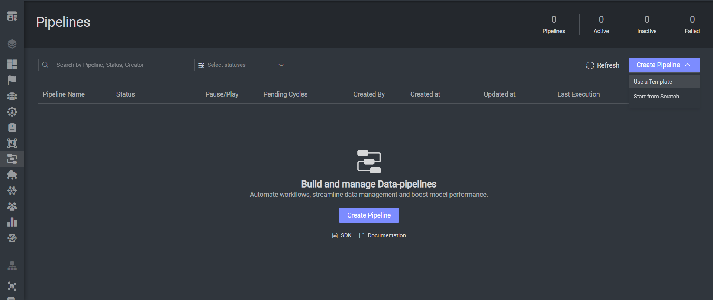

# CLIP & Ollama *RAG* Pipeline Example: Contracts

### Introduction:

This RAG solution implements the RAG template for Contracts: a contracts knowledge base (CAUD Contracts PDFs and chunk datasets), CLIP for embeddings, and Dataloop’s hosted LLM served through an Ollama server for generation. The preprocess pipeline ingests and embeds contract chunks; the retrieval pipeline retrieves relevant passages and returns short, grounded answers.

### Installation:

In order to use the template, you need to follow these steps:

* Open the pipelines page and select Create Pipeline.
* Select Use a Template from the dropdown list.

* In the search bar, type `RAG template - Contracts`, select the app and click install.
* Once the template is installed, click on *Create Pipeline*.
