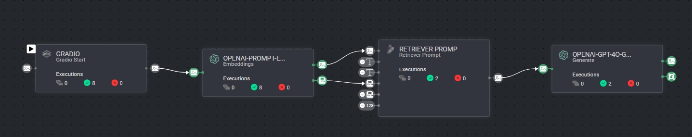

# *RAG* Pipeline Example: Recipes

### Introduction:

This RAG solution creates a template for retrieval-augmented generation using OpenAI's text embedder, ChatGPT, and a recipes 
dataset. With this approach, you can efficiently retrieve relevant documents and generate context-aware responses, 
in the context of the Recipes Dataset.

###  Installation:

In order to use the template, you need to follow these steps:

* Open the pipelines page and select Create Pipeline.
* Select Use a Template from the dropdown list.

* In the search bar, type `RAG Template - Recipes`, select the app and click install.
* Once the template is installed, click on *Create Pipeline*.

### Usage:

For the complete documentation of the Active learning pipeline, please refer to
the [Active Learning Pipeline Documentation](https://docs.dataloop.ai/docs/active-learning-pipeline)
