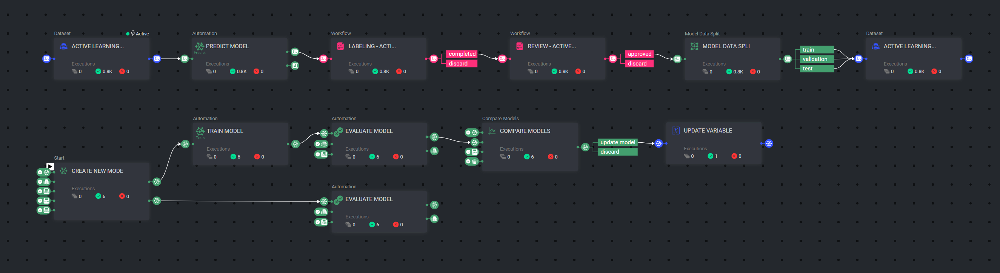
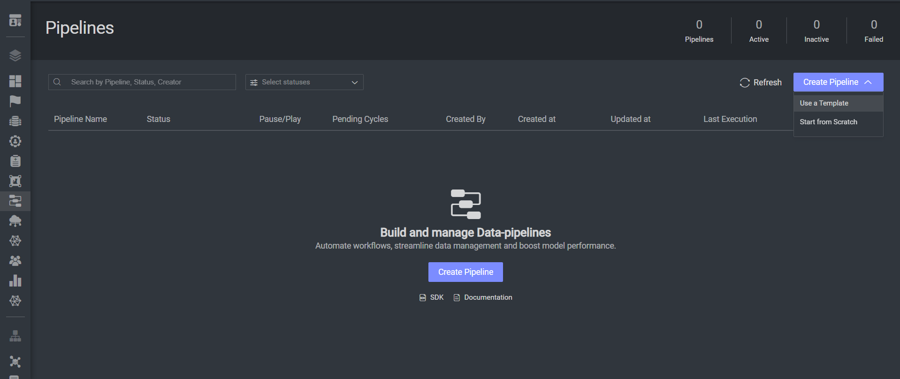
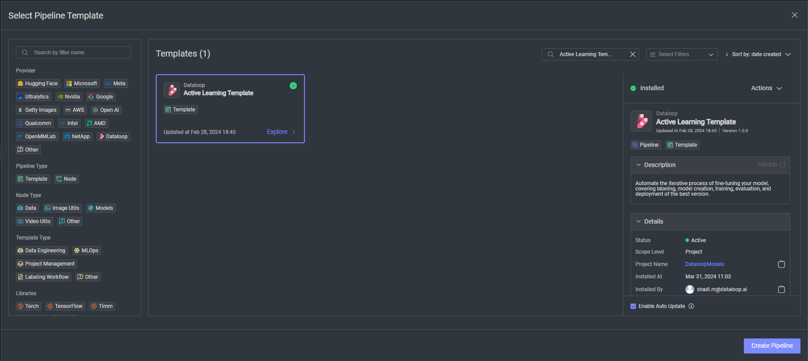

# *Active Learning* Pipeline Example: Seedlings

### Introduction:

This Active Learning pipeline includes a template for active learning with a seedlings dataset and pretrained base model. 
With Active Learning you can automate the iterative process of fine-tuning your model, covering labeling, model creation, training, evaluation, and
deployment of the best version.

###  Installation:

In order to use the template, you need to follow these steps:

* Open the pipelines page and select Create Pipeline.
* Select Use a Template from the dropdown list.

* In the search bar, type `Active Learning Example Seedlings`, select the app and click install.
* Once the template is installed, click on *Create Pipeline*.

### Usage:

For the complete documentation of the Active learning pipeline, please refer to
the [Active Learning Pipeline Documentation](https://docs.dataloop.ai/docs/active-learning-pipeline)
